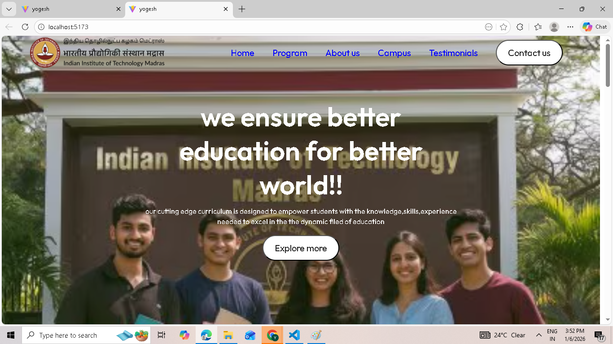
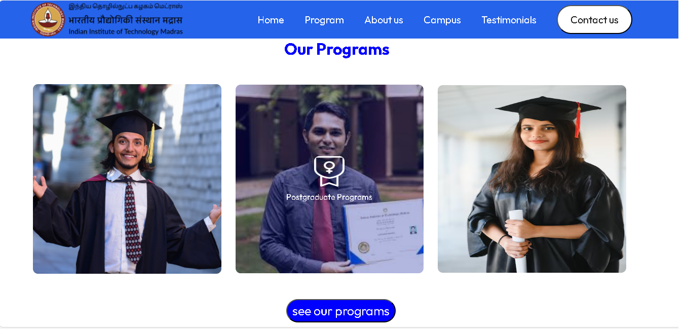
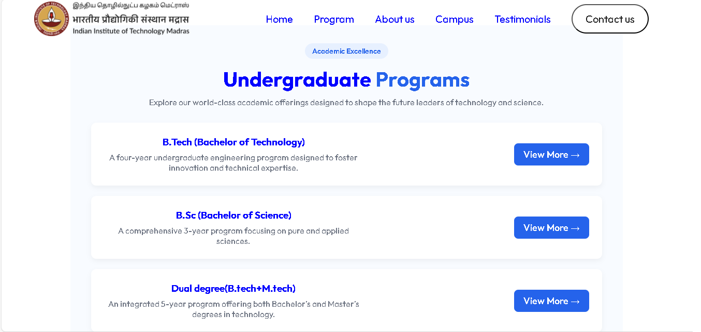
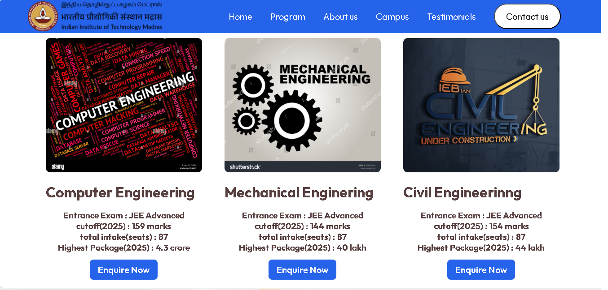
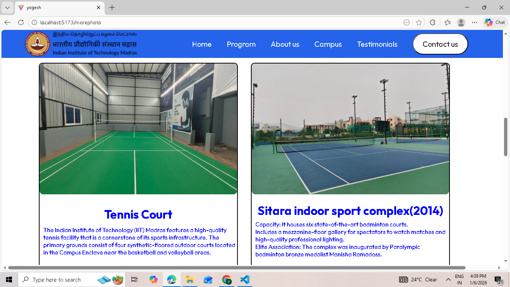
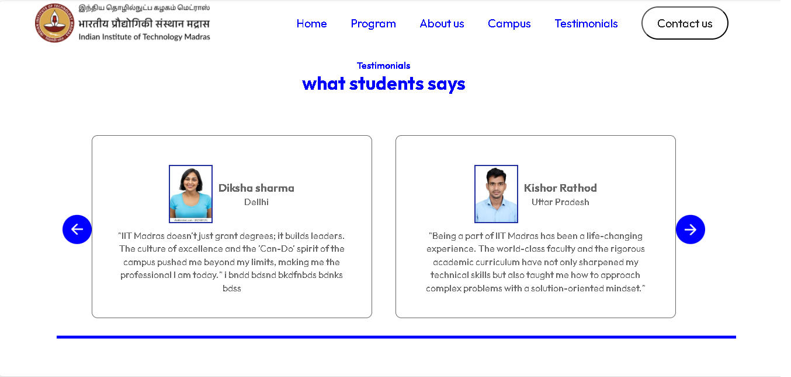
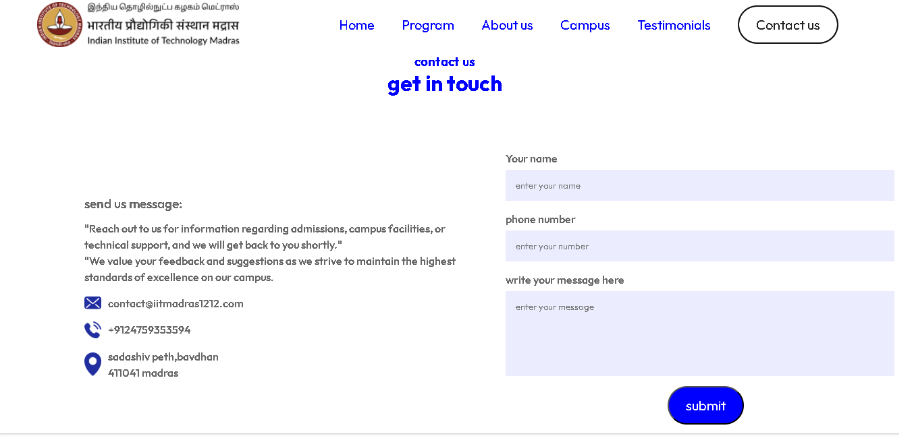
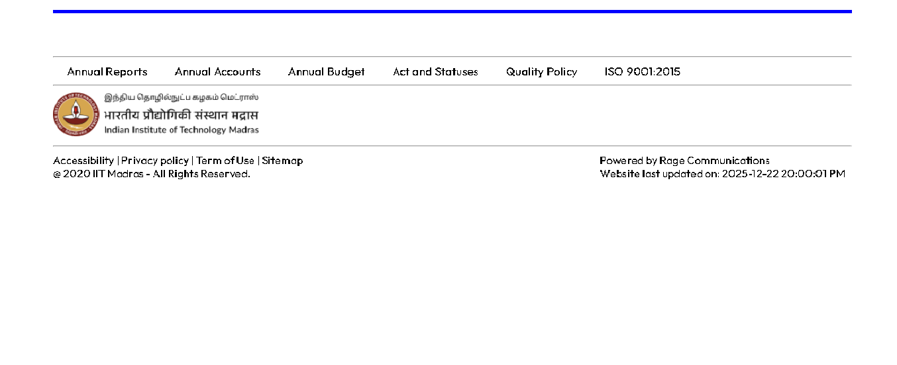

# Custom IIT Madras Web Portal

A unique, custom-designed frontend portal inspired by the IIT Madras ecosystem. This project features a completely original UI/UX layout, responsive navigation, and modular React components.

---

## 📌 Table of Contents
- [About the Project](#-about-the-project)
- [Tech Stack](#-tech-stack)
- [Features](#-features)
- [Screenshots Gallery](#-screenshots-gallery)
- [Project Structure](#-project-structure)
- [Setup & Installation](#-setup--installation)
- [Disclaimer](#-disclaimer)

---

## 📖 About the Project
Unlike a standard clone, this project is my own creative take on what a modern university portal could look like. I focused on improving user flow, accessibility, and visual hierarchy.

### Key Focus Areas:
* **Custom UI:** Designed a unique color palette and typography distinct from the official site.
* **Component Architecture:** Every section (Nav, Hero, News) is a standalone React component.
* **Responsive Layout:** Hand-coded CSS/Tailwind to ensure a seamless experience on all devices.

---

## 🛠️ Tech Stack
* **Frontend:** React.js (Vite)
* **Styling:** [Add your styling, e.g., Tailwind CSS / CSS Modules]
* **State:** React Hooks (useState, useEffect)
* **Icons:** [e.g., Lucide React / FontAwesome]

---

## ✨ Features
- **Custom UI/UX:** A unique visual identity with a specialized color palette and typography.
- **Modular Components:** Built using reusable React functional components for scalability.
- **Dynamic Navbar:** A sophisticated navigation system with multiple categories (Admissions, Campus, etc.).
- **Responsive Design:** Fully optimized for mobile, tablet, and desktop views.
- **Academic Focused:** Detailed sections for Undergraduate and Graduate program pathways.
- **Interactive Sections:** Custom-styled testimonials and integrated contact interfaces.

---

## 📸 Screenshots Gallery

### 🏠 Homepage
The main hero section featuring custom branding and navigation.



##
---


### 📚 Academic Programs
Overview of the educational offerings and departments.



##
---

### 🎓 Advanced Programs
A deeper look into specialized certifications and learning paths.



##
---

### 🧒 Undergraduate Section
Custom-designed portal specifically for prospective undergraduate students.



##
---

### 🌳 Campus Life
Visual representation of the campus environment and facilities.



##
---

### 💬 Student Testimonials
A section dedicated to the experiences and feedback of the student community.



##
---

### 📧 Contact Us
The interface for user inquiries and communication.



##
---

### 🏁 Footer
The comprehensive bottom navigation and institutional links.


---

## 🏗️ Project Structure
```text
├── public/          # Static assets
├── src/
│   ├── components/  # Reusable UI components
│   ├── assets/      # Images used in the UI
│   ├── pages/       # Main view components
│   ├── screenshots/ # Project preview images (README assets)
│   └── App.jsx      # Root component
└── package.json     # Project dependencies
